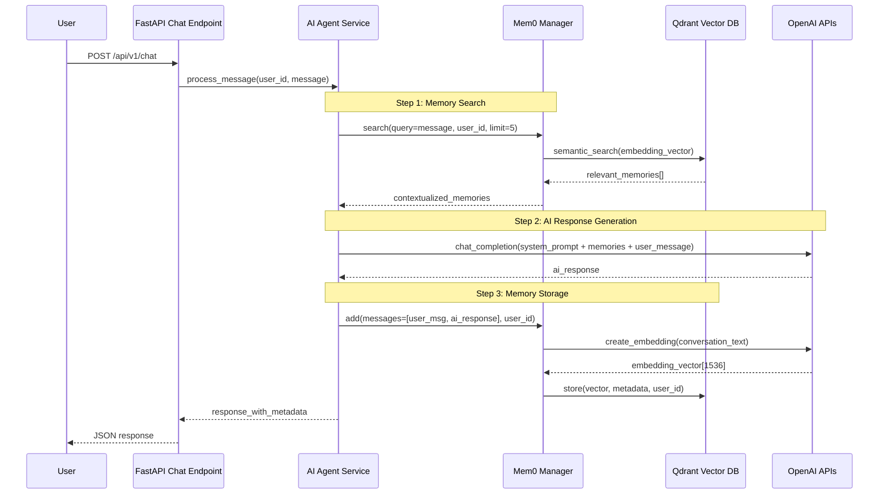

# 🧠 Mem01 AI Tutor - Complete Architecture Guide

A production-ready **conversational AI tutor** with persistent memory using **mem0**, **OpenAI LLMs**, and **Qdrant** vector database. This system demonstrates how to build intelligent AI applications that remember user interactions across sessions.

## 📋 Table of Contents

- [🏗️ Architecture Overview](#️-architecture-overview)
- [🔄 Data Flow](#-data-flow)
- [🚀 Quick Start Guide](#-quick-start-guide)
- [📁 Project Structure](#-project-structure)
- [🛠️ Development Setup](#️-development-setup)
- [🧪 Testing](#-testing)
- [🚀 Deployment](#-deployment)
- [📚 Beginner's Guide](#-beginners-guide)

## 🏗️ Architecture Overview

### **Core Components**

This system implements a **memory-powered conversational AI** with four key components:

```
User Interface (FastAPI) → AI Agent Service → Memory Manager (Mem0) → Vector Database (Qdrant)
                                    ↑                    ↓
                           OpenAI LLM APIs    ←→    Memory Storage & Retrieval
```

### **Key Technologies**

| Component | Technology | Purpose |
|-----------|------------|---------|
| **API Framework** | FastAPI | REST API endpoints and async request handling |
| **Memory Framework** | Mem0 v0.1.102 | Intelligent memory management and context building |
| **Vector Database** | Qdrant | Semantic search and persistent memory storage |
| **Language Model** | OpenAI GPT-4o-mini | Conversational AI and text generation |
| **Embeddings** | OpenAI text-embedding-ada-002 | Converting text to 1536-dimensional vectors |

### **File Architecture**

```
app/
├── main.py                     # FastAPI application entry point
├── core/
│   ├── config.py              # Pydantic settings and environment variables
│   └── mem0_manager.py        # 🧠 Central memory orchestrator
├── db/
│   └── qdrant_client.py       # 🗄️ Vector database client and collections
├── services/
│   ├── ai_agent_service.py    # 🤖 Conversational logic with memory integration
│   ├── image_service.py       # 🖼️ OpenAI image generation
│   └── voice_service.py       # 🎵 ElevenLabs voice synthesis
├── api/v1/endpoints/
│   ├── chat.py               # 💬 Main chat endpoint
│   ├── health.py             # ❤️ System health monitoring
│   └── hello_world_v1.py     # 👋 Basic API testing
└── models/
    └── chat_models.py        # 📋 Pydantic data models
```

## 🔄 Data Flow

### **Complete Conversation Flow**



### **Detailed Step-by-Step Process**

#### **Step 1: Memory Search & Context Building**
```python
# 1. User sends message to /api/v1/chat
request = {
    "user_id": "user123",
    "message": "Tell me about BPC-157 benefits",
    "session_id": "consultation_2024"
}

# 2. AI Agent searches for relevant memories
relevant_memories = memory.search(
    query=user_message,
    user_id=user_id,
    limit=5  # Configurable via MEMORY_SEARCH_LIMIT
)

# 3. System prompt enhanced with memory context
system_prompt = f"""
You are a helpful AI tutor specializing in peptide coaching...

## Relevant Previous Conversations:
{format_memories(relevant_memories)}

## Current User Question:
{user_message}
"""
```

#### **Step 2: LLM Response Generation**
```python
# 4. OpenAI generates contextual response
response = openai_client.chat.completions.create(
    model="gpt-4o-mini",  # Fast, cost-effective model
    messages=[
        {"role": "system", "content": system_prompt},
        {"role": "user", "content": user_message}
    ],
    temperature=0.7,      # Balanced creativity
    max_tokens=1000       # Response length limit
)
```

#### **Step 3: Memory Storage**
```python
# 5. Store entire conversation in memory
memory.add(
    messages=[
        {"role": "user", "content": user_message},
        {"role": "assistant", "content": ai_response}
    ],
    user_id=user_id,
    metadata={
        "session_id": session_id,
        "timestamp": datetime.now().isoformat(),
        "domain": "peptide_coaching"
    }
)

# 6. Mem0 internally:
# - Creates embeddings via OpenAI API
# - Stores vectors in Qdrant with user isolation
# - Maintains conversation context for future searches
```

### **Vector Storage Configuration**

```python
# Qdrant collection configuration
config = {
    "collection_name": "mem0_production",
    "vector_size": 1536,           # OpenAI embedding dimensions
    "distance": "Cosine",          # Similarity metric
    "on_disk": False,              # In-memory for speed
    "replication_factor": 1,       # Single replica for development
    "shard_number": 1             # Single shard for small datasets
}
```

## 🚀 Quick Start Guide

### **Prerequisites**

- **Python 3.8+** (recommended: 3.11)
- **OpenAI API Key** ([Get one here](https://platform.openai.com/api-keys))
- **Qdrant Database** (local Docker or cloud)

### **1. Environment Setup**

```bash
# Clone repository
git clone <repository-url>
cd mem01-ai-tutor

# Create virtual environment with uv (recommended)
uv venv
source .venv/bin/activate  # Unix/macOS
# .venv\Scripts\activate   # Windows

# Install dependencies
uv pip install -r requirements.txt
```

### **2. Environment Configuration**

Create `.env` file in project root:

```env
# Required API Keys
OPENAI_API_KEY=sk-your-openai-api-key-here

# Qdrant Configuration (choose one)
# Option A: Local Qdrant
QDRANT_URL=localhost:6333
QDRANT_USE_HTTPS=false

# Option B: Qdrant Cloud
# QDRANT_URL=your-cluster.qdrant.io
# QDRANT_USE_HTTPS=true
# QDRANT_API_KEY=your-qdrant-api-key

# Optional Configuration
AI_MODEL=gpt-4o-mini
MEMORY_SEARCH_LIMIT=5
QDRANT_COLLECTION_NAME=mem0_production
PORT=8000
```

### **3. Database Setup**

#### **Option A: Local Qdrant (Development)**
```bash
# Using Docker (recommended)
docker run -p 6333:6333 -p 6334:6334 qdrant/qdrant

# Verify connection
curl http://localhost:6333/health
```

#### **Option B: Qdrant Cloud (Production)**
1. Sign up at [Qdrant Cloud](https://cloud.qdrant.io/)
2. Create a cluster
3. Update `.env` with your cluster URL
4. Set `QDRANT_USE_HTTPS=true`

### **4. Launch Application**

```bash
# Start the FastAPI server
uvicorn app.main:app --reload

# Application will be available at:
# http://localhost:8000

# API Documentation available at:
# http://localhost:8000/docs (Swagger UI)
# http://localhost:8000/redoc (ReDoc)
```

### **5. Test the API**

```bash
# Health check
curl http://localhost:8000/health

# Test chat endpoint
curl -X POST "http://localhost:8000/api/v1/chat" \
  -H "Content-Type: application/json" \
  -d '{
    "user_id": "test_user",
    "message": "Hello, tell me about peptide therapy"
  }'
```

## 📁 Project Structure

```
mem01-ai-tutor/
├── 📁 app/                          # Main application code
│   ├── main.py                      # FastAPI app entry point
│   ├── core/
│   │   ├── config.py               # Settings & environment variables
│   │   └── mem0_manager.py         # 🧠 Memory system orchestrator
│   ├── db/
│   │   └── qdrant_client.py        # 🗄️ Vector database client
│   ├── services/
│   │   ├── ai_agent_service.py     # 🤖 Main conversation logic
│   │   ├── image_service.py        # 🖼️ DALL-E image generation
│   │   └── voice_service.py        # 🎵 ElevenLabs voice synthesis
│   ├── api/v1/endpoints/
│   │   ├── chat.py                 # 💬 Chat API endpoint
│   │   ├── health.py               # ❤️ System health checks
│   │   └── hello_world_v1.py       # 👋 Basic test endpoint
│   └── models/
│       └── chat_models.py          # 📋 Pydantic data models
├── 📁 tests/                       # Comprehensive test suite
│   ├── conftest.py                 # Pytest configuration
│   ├── api/v1/                     # API endpoint tests
│   ├── integration_mem0/           # Memory system integration tests
│   ├── qdrant_integration_tests/   # Database tests
│   └── utils/test_runners/         # Test execution scripts
├── 📁 gradio-peptides-app/         # Gradio UI for peptide coaching
├── 📁 gradio-ai-tutor/             # Gradio UI for AI tutoring
├── 📁 scripts/                     # Utility and demo scripts
├── 📁 docs/                        # Documentation
├── 🔧 requirements.txt             # Python dependencies
├── 🔧 docker-compose.yml           # Docker configuration
├── 🔧 Dockerfile.railway           # Railway deployment
└── 📚 README.md                    # This documentation
```

## 🛠️ Development Setup

### **Core Dependencies**

```txt
# API Framework
fastapi==0.104.1              # Modern async web framework
uvicorn==0.24.0               # ASGI server

# AI & Memory
mem0ai==0.1.102               # Memory management framework
openai==1.79.0                # OpenAI API client
qdrant-client==1.14.2         # Vector database client

# Data & Validation
pydantic==2.8.2               # Data validation and settings
pydantic-settings==2.5.2      # Environment-based configuration

# Development
pytest==8.3.4                 # Testing framework
allure-pytest==2.13.5         # Rich test reporting
gradio==4.44.1                # Web UI for demos
```

### **Development Commands**

```bash
# Start development server
uvicorn app.main:app --reload --host 0.0.0.0 --port 8000

# Run all tests with rich reporting
pytest --alluredir=allure-results -v -s

# View test reports
allure serve allure-results

# Update dependencies
uv pip compile requirements.in
uv pip install -r requirements.txt

# Run specific test suites
pytest tests/api/ -v                    # API tests only
pytest tests/integration_mem0/ -v       # Memory system tests
pytest tests/qdrant_integration_tests/ -v  # Database tests
```

### **Configuration Management**

The application uses **Pydantic Settings** for configuration:

```python
# app/core/config.py
class Settings(BaseSettings):
    # API Configuration
    app_name: str = "GenAI API"
    debug: bool = False
    port: int = 8000
    
    # OpenAI Configuration
    openai_api_key: str
    ai_model: str = "gpt-4o-mini"
    max_tokens: int = 1000
    temperature: float = 0.7
    
    # Qdrant Configuration
    qdrant_url: str = "localhost:6333"
    qdrant_use_https: bool = False
    qdrant_collection_name: str = "mem0_production"
    
    # Memory Configuration
    memory_search_limit: int = 5
    
    class Config:
        env_file = ".env"
        case_sensitive = False
```

## 🧪 Testing

### **Test Architecture**

The project includes comprehensive testing across multiple layers:

#### **1. Unit Tests**
```bash
# Test individual components
pytest tests/unit/ -v

# Test specific services
pytest tests/unit/core/test_mem0_manager.py -v
```

#### **2. API Integration Tests**
```bash
# Test API endpoints
pytest tests/api/v1/ -v

# Test chat functionality
pytest tests/test_fastapi_endpoints.py::test_chat_endpoint -v
```

#### **3. Memory System Tests**
```bash
# Test mem0 integration
pytest tests/integration_mem0/ -v

# Test conversation flow
pytest tests/e2e/test_mem0_conversation_flow.py -v
```

#### **4. Database Tests**
```bash
# Test Qdrant integration
pytest tests/qdrant_integration_tests/ -v

# Test connection and health
pytest tests/integration_mem0/test_qdrant_connection.py -v
```

### **Test Configuration**

```python
# pytest.ini
[tool:pytest]
addopts = 
    --alluredir=allure-results
    --clean-alluredir
    -v
    -s
markers =
    api: API endpoint tests
    integration: Integration tests
    slow: Tests that take longer to run
    memory: Memory system tests
    qdrant: Qdrant database tests
```

### **Running Specific Test Groups**

```bash
# Run by marker
pytest -m "api" -v                    # API tests only
pytest -m "memory" -v                 # Memory system tests
pytest -m "slow" -v                   # Long-running tests

# Run by environment
./tests/utils/test_runners/run_all_tests.sh -e dev    # Development
./tests/utils/test_runners/run_all_tests.sh -e uat    # User acceptance
./tests/utils/test_runners/run_all_tests.sh -e prod   # Production

# Run specific files
./tests/utils/test_runners/run_by_file.sh -f tests/api/v1/test_chat.py
```

## 🚀 Deployment

### **Local Development Deployment**

```bash
# Option 1: Direct Python
uvicorn app.main:app --reload --host 0.0.0.0 --port 8000

# Option 2: Docker Compose
docker-compose up --build

# Option 3: Individual Docker
docker build -f Dockerfile.railway -t genai-api .
docker run -p 8000:8000 --env-file .env genai-api
```

### **Cloud Deployment Options**

#### **Railway Deployment**
```bash
# Deploy to Railway
./deploy-railway.sh

# Or manually
railway login
railway link
railway up
```

#### **Render Deployment**
The project includes `render.yaml` for one-click Render deployment.

#### **Production Environment Variables**
```env
# Production .env
OPENAI_API_KEY=sk-prod-key
QDRANT_URL=your-production-cluster.qdrant.io
QDRANT_USE_HTTPS=true
QDRANT_API_KEY=your-prod-qdrant-key
AI_MODEL=gpt-4o-mini
DEBUG=false
MEMORY_SEARCH_LIMIT=5
```

### **Health Monitoring**

The system includes comprehensive health checks:

```bash
# Check overall system health
curl http://localhost:8000/health

# Check individual components
curl http://localhost:8000/api/v1/health/detailed
```

Response format:
```json
{
  "status": "healthy",
  "timestamp": "2024-05-28T10:30:00Z",
  "components": {
    "database": "healthy",
    "memory_system": "healthy", 
    "openai_api": "healthy",
    "qdrant_connection": "healthy"
  },
  "version": "1.0.0",
  "uptime_seconds": 3600
}
```

## 📚 Beginner's Guide

### **What is mem0 + Qdrant + OpenAI?**

This system combines three powerful technologies to create AI that remembers:

1. **OpenAI GPT-4o-mini**: The "brain" that understands and generates responses
2. **mem0**: The "memory manager" that decides what to remember and recall
3. **Qdrant**: The "storage system" that efficiently stores and searches memories

### **How Memory Works in AI Systems**

#### **Traditional AI (Stateless)**
```
User: "My name is John"
AI: "Nice to meet you, John!"

[Later conversation]
User: "What's my name?"
AI: "I don't know your name." ❌
```

#### **Memory-Powered AI (Stateful)**
```
User: "My name is John"
AI: "Nice to meet you, John!" [Stores: user_name = "John"]

[Later conversation]  
User: "What's my name?"
AI: "Your name is John!" ✅ [Retrieves: user_name = "John"]
```

### **Key Concepts Explained**

#### **1. Vector Embeddings**
- Converts text into numbers (1536 dimensions for OpenAI)
- Similar concepts have similar numbers
- Example: "peptide therapy" and "BPC-157" are numerically similar

#### **2. Semantic Search**
- Find related content based on meaning, not exact words
- User asks: "Tell me about healing peptides"
- System finds: Previous conversation about "BPC-157 recovery benefits"

#### **3. User Isolation**
- Each user's memories are completely separate
- User A cannot see User B's conversations
- Achieved through `user_id` filtering in database queries

### **Understanding the Chat Flow**

1. **You send a message** → System receives your text
2. **Memory search happens** → System looks for related past conversations
3. **Context building** → System combines your question with relevant memories
4. **AI generates response** → OpenAI creates an answer with full context
5. **Memory storage** → System saves this new conversation for future reference

### **Common Use Cases**

#### **Educational Tutoring**
- Remembers your learning progress
- Builds on previous lessons
- Adapts difficulty based on your understanding

#### **Health Coaching**
- Maintains your health profile
- Tracks your goals and progress
- Provides personalized advice based on history

#### **Customer Support**
- Remembers your previous issues
- Understands your product setup
- Provides consistent service across sessions

### **Getting Started Tips**

1. **Start Small**: Begin with simple questions to see how memory works
2. **Test Memory**: Ask about something you mentioned earlier
3. **Use Unique User IDs**: Each person should have their own identifier
4. **Check Health**: Use `/health` endpoint to verify everything works
5. **Read Logs**: Check console output to understand the flow

### **Common Issues & Solutions**

#### **"Memory not working"**
- Check Qdrant connection: `curl http://localhost:6333/health`
- Verify OpenAI API key is valid
- Ensure `user_id` is consistent across conversations

#### **"Slow responses"**
- Reduce `MEMORY_SEARCH_LIMIT` (default: 5)
- Use local Qdrant instead of cloud for development
- Check network connectivity

#### **"API errors"**
- Verify all environment variables are set
- Check OpenAI API key credits/limits
- Review application logs for detailed error messages

### **Next Steps**

1. **Explore the Gradio Apps**: See working examples in `gradio-peptides-app/` and `gradio-ai-tutor/`
2. **Modify the System Prompt**: Edit the AI's personality in `ai_agent_service.py`
3. **Add New Endpoints**: Create custom API endpoints in `app/api/v1/endpoints/`
4. **Customize Memory Logic**: Modify search and storage behavior in `mem0_manager.py`
5. **Deploy to Production**: Use Railway, Render, or your preferred platform

### **Learning Resources**

- [Mem0 Documentation](https://docs.mem0.ai/)
- [Qdrant Vector Database Guide](https://qdrant.tech/documentation/)
- [OpenAI API Reference](https://platform.openai.com/docs/api-reference)
- [FastAPI Tutorial](https://fastapi.tiangolo.com/tutorial/)
- [Pydantic Documentation](https://docs.pydantic.dev/)

---

## 🤝 Contributing

Contributions welcome! Focus areas:
- Additional AI application examples
- Enhanced memory management patterns  
- New deployment configurations
- Improved testing coverage
- Documentation improvements

### Development Process
1. Fork the repository
2. Create feature branch: `git checkout -b feature/amazing-feature`
3. Add tests for your changes
4. Run full test suite: `pytest --alluredir=allure-results -v`
5. Commit changes: `git commit -m 'Add amazing feature'`
6. Push branch: `git push origin feature/amazing-feature`
7. Open Pull Request

## 📄 License

MIT License - see LICENSE file for details.

---

**🚀 Ready to build memory-powered AI applications?** 

Start with the quick setup guide above, then explore the Gradio demo applications to see the system in action!